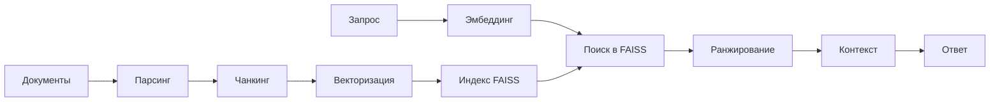

# Архитектура RAG ULTRA v0.1

## 🏛️ Общая архитектура



## 📂 Модульная структура

### 1. Парсеры (`parsers/`)
Извлечение структурированного контента из различных форматов:

- **pdf_parser.py** - обработка PDF с OCR и извлечением таблиц
- **docx_parser.py** - парсинг Word документов с сохранением структуры
- **excel_csv_parser.py** - обработка таблиц Excel/CSV
- **pptx_parser.py** - извлечение контента из презентаций
- **doc_binary_parser.py** - обработка старых .doc файлов
- **html_md_parser.py** - парсинг HTML и Markdown
- **txt_parser.py** - обработка текстовых файлов
- **pg_loader.py** - загрузка из PostgreSQL

### 2. Обработка (`doc_ingest/`)

#### Основной пайплайн:
1. **1.main_parse_doc.py** - координатор парсинга всех документов
2. **2.main_build_doc_fields_index.py** - создание метаданных документов
3. **3.main_build_field_lexicon.py** - построение частотного словаря
4. **4.main_embed.py** - векторизация и индексация

#### Вспомогательные модули:
- **chunking.py** - семантическое разбиение на чанки
- **embed_utils.py** - утилиты для работы с эмбеддингами
- **embed_faiss.py** - построение FAISS индекса
- **embed_qdrant.py** - интеграция с Qdrant (опционально)
- **graph_builder.py** - построение графа связей документов

### 3. Поиск и ранжирование (`retrieval/`)

- **searcher.py** - семантический поиск по векторному индексу
- **universal_searcher.py** - гибридный поиск (semantic + lexical)
- **reranker.py** - переранжирование с CrossEncoder
- **context_builder.py** - построение контекста для LLM

### 4. API сервис (`service/`)

- **search_api.py** - FastAPI сервер с REST API

## 🔄 Поток данных

### Этап индексации:
```
Документы → Парсинг → DocElement → Чанкинг → Chunk → Эмбеддинг → FAISS Index
                ↓                      ↓                    ↓
           Извлечение              Метаданные          Векторы
           изображений             (JSON)              (NPZ/Index)
```

### Этап поиска:
```
Запрос → Эмбеддинг → Векторный поиск → Top-K кандидатов → Ранжирование → Контекст
            ↓              ↓                    ↓              ↓
        Query vector    FAISS search      Фильтрация    CrossEncoder
                                          по метаданным   scoring
```

## 🎯 Ключевые компоненты

### DocElement
Базовая единица контента после парсинга:
```python
@dataclass
class DocElement:
    text: str                    # текстовое содержимое
    element_type: str            # paragraph/heading/table/formula
    category: Optional[str]      # категория документа
    doc_id: Optional[str]        # ID документа
    doc_path: Optional[str]      # путь к файлу
    page: Optional[int]          # номер страницы
    order: Optional[int]         # порядок на странице
    heading_path: List[str]      # иерархия заголовков
    media_refs: List[str]        # ссылки на медиа
```

### Chunk
Семантически связанный фрагмент для поиска:
```python
@dataclass
class Chunk:
    text: str                    # объединенный текст
    doc_id: str                  # привязка к документу
    chunk_index: int             # индекс в документе
    page_from: Optional[int]     # начальная страница
    page_to: Optional[int]       # конечная страница
    heading_path: List[str]      # контекст заголовков
    element_types: List[str]     # типы элементов в чанке
```

## 🚀 Оптимизации

### Производительность:
1. **Батчевая обработка** - параллельная векторизация
2. **Кэширование эмбеддингов** - избежание повторных вычислений
3. **FAISS индекс** - быстрый приближенный поиск (IVF)
4. **Асинхронный API** - обработка множественных запросов

### Качество:
1. **Семантическое чанкирование** - сохранение смысловой целостности
2. **Иерархический контекст** - учет структуры документа
3. **Гибридное ранжирование** - комбинация cosine + CrossEncoder
4. **Адаптивный контекст** - оптимизация под токен-бюджет LLM

## 🔧 Конфигурация

Все настройки централизованы в `config.py`:

- **PipelineConfig** - параметры парсинга и обработки
- **EmbeddingConfig** - настройки векторизации и чанкинга
- **RerankerConfig** - параметры ранжирования
- **ContextConfig** - настройки построения контекста

## 📊 Метрики и мониторинг

### Ключевые метрики:
- Latency поиска: < 200ms (CPU), < 50ms (GPU)
- Recall@10: > 0.85
- Precision@5: > 0.75
- Пропускная способность: 50+ RPS

### Точки мониторинга:
1. Время парсинга документов
2. Скорость векторизации (docs/sec)
3. Latency поиска (p50, p95, p99)
4. Использование памяти индексом
5. Cache hit rate

## 🔮 Планы развития

### v0.2 (Q2 2025):
- [ ] Инкрементальная индексация
- [ ] Multi-index поиск
- [ ] Streaming обработка больших документов
- [ ] GraphRAG интеграция

### v0.3 (Q3 2025):
- [ ] Multimodal поиск (текст + изображения)
- [ ] Fine-tuning моделей на корпусе
- [ ] A/B тестирование ранжирования
- [ ] Distributed индексация

## 🛠️ Разработка

### Добавление нового парсера:
1. Создать файл в `parsers/`
2. Реализовать функцию `parse_<format>(path, category, **kwargs) -> List[DocElement]`
3. Добавить роутинг в `route_parse()` в `1.main_parse_doc.py`
4. Обновить `SUPPORTED` форматы

### Добавление нового индекса:
1. Создать модуль `embed_<index>.py`
2. Реализовать интерфейс построения и поиска
3. Обновить `EmbeddingConfig.index_kind`
4. Добавить вызов в `4.main_embed.py`

### Тестирование:
```bash
# Unit тесты парсеров
pytest tests/test_parsers.py

# Интеграционный тест пайплайна
python test_rag_system.py

# Нагрузочное тестирование API
locust -f tests/load_test.py
```

## 📚 Используемые технологии

- **Векторизация**: SentenceTransformers (SBERT)
- **Индексация**: FAISS (Facebook AI)
- **Ранжирование**: CrossEncoder
- **API**: FastAPI + Uvicorn
- **Парсинг**: LangChain Unstructured
- **OCR**: Tesseract
- **Графы**: NetworkX

---

*Документация актуальна для версии 0.1*
