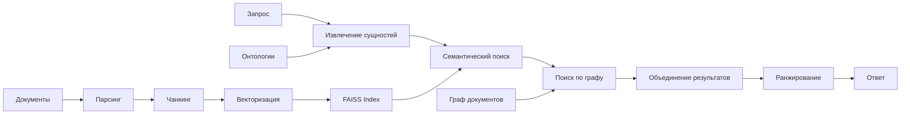

# 🚀 RAG ULTRA v0.1 - Продвинутая система семантического поиска

## 📋 Описание проекта

RAG ULTRA - это интеллектуальная система поиска и анализа корпоративных документов с поддержкой:

### ✨ Основные возможности
- **Мультиформатный парсинг**: PDF, DOCX, XLSX, PPTX, TXT, HTML, MD
- **Семантический поиск**: векторные эмбеддинги + гибридное ранжирование
- **Граф документов**: анализ связей и иерархии документов
- **Извлечение сущностей**: понимание контекста запросов
- **Доменная специализация**: адаптация под строительную отрасль
- **REST API**: готовый к интеграции сервис

### 🆕 Новые возможности v0.1
- **Граф документов**: поиск по структурным связям между документами
- **Извлечение сущностей**: 22 типа сущностей для понимания запросов
- **Онтологии и справочники**: специализированные словари для строительной отрасли
- **LLM интеграция**: поддержка локальных языковых моделей
- **Продвинутое ранжирование**: комбинирование семантического и графового поиска

## 🏗️ Архитектура системы



## 📦 Требования

### Системные требования
- **Python**: 3.10+
- **RAM**: минимум 4GB, рекомендуется 8GB+
- **Дисковое пространство**: 10GB+ для моделей и индексов
- **GPU**: опционально (CUDA 11.8+ для ускорения)

### Рекомендуемые характеристики
- **CPU**: 8+ ядер
- **RAM**: 16GB+
- **GPU**: NVIDIA RTX 3060+ (для LLM моделей)
- **SSD**: для быстрой работы с индексами

## 🚀 Быстрый старт

### 1. Подготовка окружения

```bash
# Клонирование репозитория
git clone <repository_url>
cd RAG_ULTRA_v0.1

# Создание conda окружения
conda env create -f environment.yml
conda activate corp-rag

# Проверка установки
python -c "import torch, faiss, numpy as np; print('✅ Окружение готово')"
```

### 2. Загрузка моделей

#### 2.1 Модели эмбеддингов и ранжирования

```bash
# Запуск ноутбука для загрузки моделей
jupyter notebook Download_model_embeddings.ipynb
jupyter notebook Download_model_Reranker.ipynb
```

Или через Python:

```python
from huggingface_hub import snapshot_download

# Модель эмбеддингов (~1.7GB)
snapshot_download(
    repo_id="ai-forever/sbert_large_nlu_ru",
    local_dir="doc_ingest/models/sbert_large_nlu_ru"
)

# Модель ранжирования (~420MB)
from sentence_transformers import CrossEncoder
ce = CrossEncoder("DiTy/cross-encoder-russian-msmarco")
ce.save_pretrained("doc_ingest/models/reranker_ru")
```

#### 2.2 LLM модель (опционально)

```bash
# Запуск ноутбука для загрузки LLM
jupyter notebook Download_model_LLM.ipynb
```

### 3. Подготовка документов

Создайте структуру папок для ваших документов:

```
doc_ingest/doc/
├── PDF/                    # PDF документы
│   ├── Цемент/            # Подкатегории
│   ├── Железобетонные_изделия/
│   └── Нерудные_материалы/
├── WORD/                   # DOC/DOCX файлы
├── EXCEL/                  # XLS/XLSX таблицы
├── PPTX/                   # Презентации
├── TXT_MD/                 # Текстовые и Markdown файлы
└── [другие категории]/
```

### 4. Обработка документов

```bash
cd doc_ingest

# 1️⃣ Парсинг документов
python 1.main_parse_doc.py
# ⏱️ 5-30 минут | 📊 outputs/dataset/elements.jsonl

# 2️⃣ Построение индекса полей
python 2.main_build_doc_fields_index.py
# ⏱️ 1-5 минут | 📊 outputs/index/doc_fields_meta.json

# 3️⃣ Создание лексикона
python 3.main_build_field_lexicon.py
# ⏱️ < 1 минуты | 📊 outputs/index/lexicon_doc_fields.json

# 4️⃣ Векторизация и создание графа
python 4.main_embed.py
# ⏱️ 10-60 минут | 📊 outputs/index/faiss.index + outputs/graphs/
```

### 5. Запуск API сервиса

```bash
# Запуск сервиса
cd service
uvicorn search_api:app --reload --host 0.0.0.0 --port 8000

# API доступен: http://localhost:8000
# Документация: http://localhost:8000/docs
```

## 🔍 Использование API

### Базовый поиск v1

```bash
# Простой поиск
curl "http://localhost:8000/api/search?q=условия поставки&top_k=10"

# Поиск с фильтрами
curl "http://localhost:8000/api/search?q=договор&top_k=5&category=Цемент&window=2"
```

### Продвинутый поиск v2 (с графом и сущностями)

```bash
# Поиск с использованием графа документов
curl "http://localhost:8000/api/v2/search?q=Поставка цемента М500 на станцию Ферзиково&top_k=5&use_graph=true&use_entities=true"

# Поиск только по сущностям
curl "http://localhost:8000/api/v2/search?q=Договор поставки щебня&use_graph=false&use_entities=true"
```

### Извлечение сущностей

```bash
# Извлечение сущностей из запроса
curl -X POST "http://localhost:8000/api/extract_entities" \
  -H "Content-Type: application/json" \
  -d '{"query": "Договор поставки цемента М500 ГОСТ 31108-2020 в количестве 3000 тонн"}'
```

### Работа с графом документов

```bash
# Информация об узле графа
curl "http://localhost:8000/api/graph/node/document_id_here"

# Поиск похожих документов
curl "http://localhost:8000/api/graph/similar/document_id_here?top_k=5"
```

## 📁 Структура проекта

```
RAG_ULTRA_v0.1-coursor/
├── 📄 README.md                    # Документация
├── 📄 environment.yml              # Конфигурация окружения
├── 📄 requirements.txt             # Зависимости Python
├── 📄 setup.txt                    # Инструкции по установке
│
├── 📁 doc_ingest/                  # Основной модуль
│   ├── 📄 config.py                # Конфигурация системы
│   ├── 📄 models.py                # Модели данных
│   ├── 📄 1.main_parse_doc.py      # Этап 1: Парсинг
│   ├── 📄 2.main_build_doc_fields_index.py  # Этап 2: Индексация
│   ├── 📄 3.main_build_field_lexicon.py     # Этап 3: Лексикон
│   ├── 📄 4.main_embed.py          # Этап 4: Векторизация
│   ├── 📄 chunking.py              # Семантическое разбиение
│   ├── 📄 embed_utils.py           # Утилиты эмбеддингов
│   ├── 📄 embed_faiss.py           # FAISS интеграция
│   ├── 📄 embed_qdrant.py          # Qdrant интеграция
│   ├── 📄 graph_builder.py         # Построение графа документов
│   ├── 📄 entity_extractor.py      # Извлечение сущностей
│   │
│   ├── 📁 parsers/                 # Парсеры документов
│   │   ├── 📄 pdf_parser.py        # PDF с OCR и таблицами
│   │   ├── 📄 docx_parser.py       # Word документы
│   │   ├── 📄 excel_csv_parser.py  # Excel/CSV таблицы
│   │   ├── 📄 pptx_parser.py       # Презентации
│   │   ├── 📄 html_md_parser.py    # HTML/Markdown
│   │   ├── 📄 txt_parser.py        # Текстовые файлы
│   │   └── 📄 pg_loader.py         # PostgreSQL загрузка
│   │
│   ├── 📁 retrieval/               # Поиск и ранжирование
│   │   ├── 📄 searcher.py          # Базовый семантический поиск
│   │   ├── 📄 universal_searcher.py # Универсальный поисковик
│   │   ├── 📄 graph_searcher.py    # Поиск по графу
│   │   ├── 📄 reranker.py          # Переранжирование
│   │   ├── 📄 context_builder.py   # Построение контекста
│   │   └── 📄 universal_searcher.py # Интегрированный поиск
│   │
│   ├── 📁 service/                 # API сервис
│   │   └── 📄 search_api.py        # FastAPI сервер
│   │
│   ├── 📁 models/                  # ML модели
│   │   ├── 📁 sbert_large_nlu_ru/  # Модель эмбеддингов
│   │   ├── 📁 reranker_ru/         # Модель ранжирования
│   │   └── 📁 llm/                 # LLM модели (опционально)
│   │
│   ├── 📁 dictionaries/            # Справочники и онтологии
│   │   ├── 📄 products.json        # Каталог строительных материалов
│   │   ├── 📄 logistics.json       # Логистические термины
│   │   ├── 📄 organizations.json   # Организационная структура
│   │   └── 📄 domains.json         # Домены и процессы
│   │
│   ├── 📁 doc/                     # Ваши документы
│   │   ├── 📁 PDF/
│   │   ├── 📁 WORD/
│   │   ├── 📁 EXCEL/
│   │   └── 📁 [другие категории]/
│   │
│   └── 📁 outputs/                 # Результаты обработки
│       ├── 📁 dataset/             # Парсенные элементы
│       ├── 📁 index/               # Поисковые индексы
│       ├── 📁 media/               # Извлеченные изображения
│       └── 📁 graphs/              # Графы документов
│
├── 📁 Download_model_*.ipynb       # Ноутбуки для загрузки моделей
├── 📄 test_rag_system.py           # Тестирование системы
└── 📄 quickstart.py                # Быстрый старт
```

## ⚙️ Конфигурация

### Основные настройки (`doc_ingest/config.py`)

```python
# PipelineConfig - настройки парсинга
pdf_ocr_fallback: bool = True        # OCR для сканированных PDF
pdf_table_extraction: bool = True    # Извлечение таблиц
keep_images: bool = True             # Сохранение изображений
max_chars_per_element: int = 15000   # Максимальный размер элемента
workers: int = 4                     # Количество потоков

# EmbeddingConfig - настройки векторизации
model_name: str = "ai-forever/sbert_large_nlu_ru"
device: str = "auto"                 # "auto"/"cuda"/"cpu"
chunk_target_tokens: int = 350       # Размер чанка
batch_size: int = 32                 # Размер батча

# UniversalSearchConfig - настройки поиска
use_graph_search: bool = True        # Использовать граф
use_entity_extraction: bool = True   # Извлекать сущности
graph_weight: float = 0.3            # Вес результатов графа
entity_weight: float = 0.2           # Вес совпадения сущностей
```

### Настройка справочников

Справочники находятся в `doc_ingest/dictionaries/`:

- **products.json** - каталог строительных материалов
- **logistics.json** - логистические термины и станции
- **organizations.json** - подразделения и должности
- **domains.json** - домены и бизнес-процессы

Вы можете расширить эти справочники под ваши нужды.

## 🔧 Продвинутое использование

### Интеграция с LLM

```python
from doc_ingest.entity_extractor import EntityExtractor

# Инициализация с LLM моделью
extractor = EntityExtractor(
    use_llm=True,
    llm_model_path="doc_ingest/models/llm/llama-3.1-8b-instruct"
)

# Извлечение сущностей
entities = extractor.extract("Поставка цемента М500 на станцию Ферзиково")
print(entities.to_dict())
```

### Работа с графом документов

```python
from doc_ingest.retrieval.graph_searcher import GraphSearcher

# Инициализация поисковика по графу
searcher = GraphSearcher()

# Поиск с использованием сущностей
results = searcher.search(
    query="Договор поставки цемента",
    top_k=10,
    use_entities=True,
    expand_graph=True
)

# Поиск похожих документов
similar = searcher.find_similar_documents("document_id", top_k=5)
```

### Кастомные справочники

```python
# Добавление новых терминов в справочник
import json

with open("doc_ingest/dictionaries/products.json", "r", encoding="utf-8") as f:
    products = json.load(f)

# Добавляем новый материал
products["новый_материал"] = {
    "марки": ["М100", "М200"],
    "госты": ["ГОСТ 12345-2020"],
    "характеристики": ["прочность", "морозостойкость"]
}

with open("doc_ingest/dictionaries/products.json", "w", encoding="utf-8") as f:
    json.dump(products, f, ensure_ascii=False, indent=2)
```

## 📊 Производительность

### Временные показатели

| Этап | CPU (8 cores) | GPU (RTX 3060) | GPU (RTX 4090) |
|------|---------------|----------------|----------------|
| Парсинг документов | 15 мин | 15 мин | 15 мин |
| Построение индексов | 2 мин | 2 мин | 2 мин |
| Векторизация | 45 мин | 10 мин | 5 мин |
| Построение графа | 5 мин | 5 мин | 5 мин |
| Поиск (1 запрос) | 200ms | 50ms | 30ms |

### Потребление ресурсов

| Компонент | RAM | VRAM | Диск |
|-----------|-----|------|------|
| Модель эмбеддингов | 2GB | 1GB | 1.7GB |
| Модель ранжирования | 1GB | 0.5GB | 420MB |
| LLM модель (8B) | 16GB | 8GB | 16GB |
| FAISS индекс | 1GB | - | 2GB |
| Граф документов | 0.5GB | - | 100MB |

## 🐛 Решение проблем

### Частые ошибки

#### 1. "Module not found"
```bash
# Проверьте активацию окружения
conda activate corp-rag
conda list | grep torch
```

#### 2. Недостаточно памяти
```python
# Уменьшите batch_size в config.py
batch_size: int = 16  # вместо 32
workers: int = 2      # вместо 4
```

#### 3. Медленная обработка
```python
# Включите GPU ускорение
device: str = "cuda"  # в config.py
```

#### 4. Ошибка загрузки моделей
```bash
# Установите дополнительные зависимости
pip install huggingface-hub sentence-transformers
pip install transformers accelerate bitsandbytes
```

#### 5. Проблемы с графом
```bash
# Проверьте наличие NetworkX
pip install networkx
# Пересоздайте граф
python 4.main_embed.py
```

### Логи и отладка

```bash
# Включение подробных логов
export PYTHONPATH=.
python -u doc_ingest/1.main_parse_doc.py 2>&1 | tee parse.log

# Проверка состояния системы
curl "http://localhost:8000/healthz"
```

## 🔄 Обновление и поддержка

### Добавление новых документов

```bash
# 1. Добавьте документы в doc_ingest/doc/
# 2. Перезапустите обработку
python 1.main_parse_doc.py
python 2.main_build_doc_fields_index.py
python 3.main_build_field_lexicon.py
python 4.main_embed.py
# 3. Перезапустите API
```

### Обновление справочников

```bash
# Отредактируйте файлы в doc_ingest/dictionaries/
# Перезапустите API сервис
```

### Обновление моделей

```bash
# Запустите соответствующие ноутбуки
jupyter notebook Download_model_embeddings.ipynb
jupyter notebook Download_model_Reranker.ipynb
jupyter notebook Download_model_LLM.ipynb
```

## 📈 Мониторинг и метрики

### API метрики

```bash
# Статистика кэша
curl "http://localhost:8000/api/cache_stats"

# Время выполнения запросов
curl "http://localhost:8000/api/v2/search?q=тест" | jq '.took_ms'
```

### Логирование

```python
import logging
logging.basicConfig(level=logging.INFO)

# Логирование в файл
logging.basicConfig(
    filename='rag_system.log',
    level=logging.INFO,
    format='%(asctime)s - %(name)s - %(levelname)s - %(message)s'
)
```

## 🤝 Поддержка и сообщество

### Полезные ссылки
- **Документация API**: http://localhost:8000/docs
- **Swagger UI**: http://localhost:8000/redoc
- **Статус системы**: http://localhost:8000/healthz

### Отчеты об ошибках
При возникновении проблем:
1. Проверьте логи в консоли
2. Убедитесь в корректности конфигурации
3. Проверьте наличие всех моделей
4. Создайте issue с описанием проблемы

### Вклад в проект
Мы приветствуем вклад в развитие проекта:
- Исправление ошибок
- Добавление новых функций
- Улучшение документации
- Расширение справочников

## 📄 Лицензия

Проект использует открытые модели и библиотеки:
- **sbert_large_nlu_ru**: Apache 2.0
- **cross-encoder-russian-msmarco**: Apache 2.0
- **Llama 3.1**: Meta License
- **FAISS**: MIT License
- **Sentence Transformers**: Apache 2.0

## 📞 Контакты

- **Версия**: 0.1
- **Последнее обновление**: Январь 2025
- **Поддержка**: Создавайте issues в репозитории

---

**🚀 Готово к использованию!** Система полностью настроена и готова для интеллектуального поиска по вашим документам.
